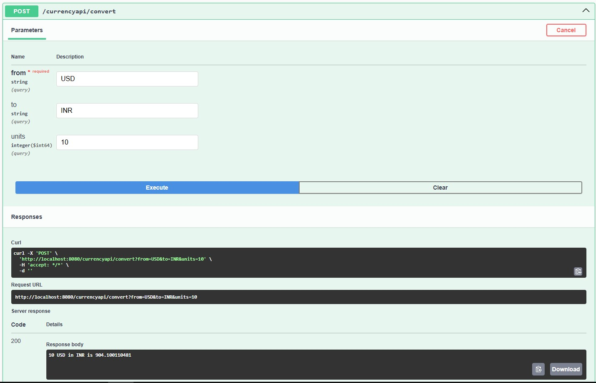

# Building a currency converter using RestClient

#### after running the application on localhost, hit the url http://localhost:8080/swagger-ui/index.html#/

#####Getting the rates of currencies in terms of USD as default

#####Converting a currency into another with the number of units

